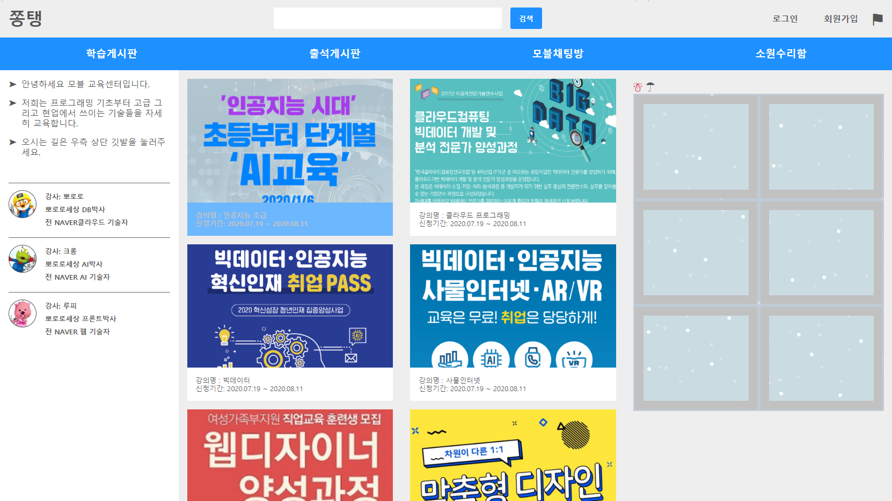
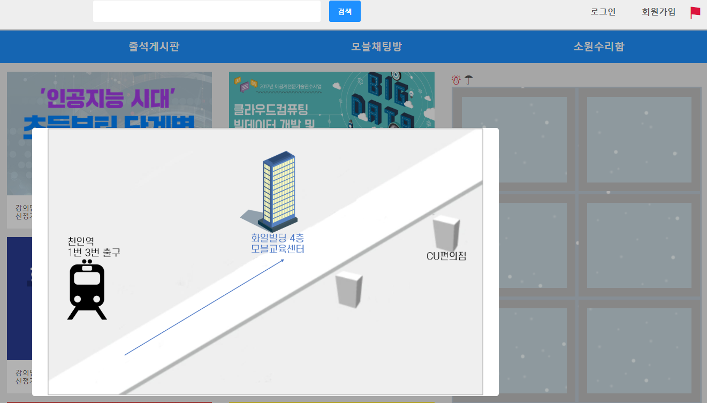
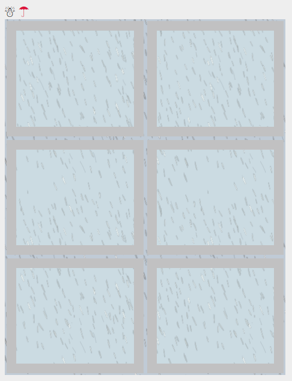

# 처음 만든 웹페이지

## 1. 전체적인 모습

- `display: flex ` 를 전체구성으로 만들었습니다.
- 헤더, 네비게이션바, 좌측 사이드바, 중간 컨텐츠영역, 우측 사이드바, 하단 바로 구성했습니다.
- 모달창과 눈, 비 애니메이션

## 2. 모달창

- 우측 상단 회원가입 옆 깃발표시를 누르면 모달창이 나옵니다.

## 3. 눈, 비 애니메이션

- 눈사람을 누르면 눈이 내리고 우산을 누르면 비가옵니다.

